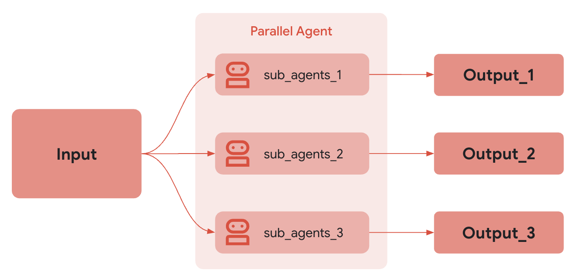

# Parallel Agents in ADK

## ADK Concept: Parallel Agents

In the Google Agent Development Kit (ADK), parallel agents are workflow agents that execute multiple sub-agents simultaneously. This enables concurrent processing of tasks, allowing for efficient handling of independent operations that can be performed in parallel.

### What are Parallel Agents?

A parallel agent orchestrates the concurrent execution of multiple specialized agents, collecting their outputs and combining them into a comprehensive response. This pattern is particularly useful for:

- Processing independent tasks simultaneously to reduce overall response time
- Gathering information from multiple sources in parallel
- Distributing workload across specialized agents
- Implementing fan-out, fan-in processing patterns

Parallel agents are one of several workflow agent types in ADK, specifically designed for workflows where sub-tasks can be executed independently and concurrently.

### How Parallel Agents Work

The `ParallelAgent` class in ADK:

1. Takes a list of sub-agents to execute in parallel
2. When invoked, runs all sub-agents concurrently
3. Collects outputs from all sub-agents
4. Combines the collected outputs into a unified response


Each sub-agent processes the same input independently, and their outputs are aggregated. This differs from sequential agents, where output from one agent becomes the input for the next.



## Implementation Details

This folder contains examples of parallel agent implementations in ADK.

### Project Structure
```
11-parallel-agent/
├── system_monitor_agent/
│   ├── agent.py
│   ├── __init__.py
│   └── subagents/
│       ├── cpu_info_agent.py
│       ├── disk_info_agent.py
│       ├── memory_info_agent.py
│       └── synthesizer_agent.py
└── result_imgs/
```

### Example: System Monitor Agent

The system monitor example demonstrates a parallel workflow for gathering system information:

```python
from google.adk.agents import ParallelAgent, SequentialAgent

from .subagents.cpu_info_agent import cpu_info_agent
from .subagents.disk_info_agent import disk_info_agent
from .subagents.memory_info_agent import memory_info_agent
from .subagents.synthesizer_agent import system_report_synthesizer

# --- 1. Create Parallel Agent to gather information concurrently ---
system_info_gatherer = ParallelAgent(
    name="system_info_gatherer",
    sub_agents=[cpu_info_agent, memory_info_agent, disk_info_agent],
)

# --- 2. Create Sequential Pipeline to gather info in parallel, then synthesize ---
root_agent = SequentialAgent(
    name="system_monitor_agent",
    sub_agents=[system_info_gatherer, system_report_synthesizer],
)
```

This implementation consists of:

1. **Parallel Agent (system_info_gatherer)**: Concurrently executes three specialized agents:
   - **CPU Info Agent**: Gathers information about CPU usage and specifications
   - **Memory Info Agent**: Collects details about system memory usage
   - **Disk Info Agent**: Retrieves information about disk storage

2. **Sequential Wrapper**: The root agent is a sequential agent that:
   - First runs the parallel agent to gather all system information concurrently
   - Then passes the collected information to a synthesizer agent that creates a consolidated report

### Workflow and Execution

When the system monitor agent processes a request, it follows this flow:

1. The user sends a request for system information
2. The sequential root agent passes the request to the parallel agent (system_info_gatherer)
3. The parallel agent dispatches the request to all sub-agents simultaneously:
   - cpu_info_agent processes the request and returns CPU information
   - memory_info_agent processes the request and returns memory information
   - disk_info_agent processes the request and returns disk information
4. The parallel agent collects all the outputs and combines them
5. The sequential root agent passes the combined output to the synthesizer agent
6. The synthesizer agent creates a consolidated report
7. The final report is returned to the user

### Combining Parallel with Sequential Processing

The example demonstrates how to combine parallel and sequential processing:

1. **Parallel Processing**: Used for gathering independent pieces of information concurrently
2. **Sequential Follow-up**: Used for processing the combined information once it's all available

This pattern of "fan-out, gather, process" is common in many applications:
- Gather information from multiple sources in parallel (fan-out)
- Combine the information (gather)
- Process the combined information to create a unified result (process)

### Benefits of Parallel Agents

1. **Improved Efficiency**: Reduces overall processing time by executing tasks concurrently
2. **Resource Utilization**: Makes better use of available computational resources
3. **Scalability**: Easily add more parallel tasks without increasing overall response time
4. **Independence**: Each sub-agent operates independently without waiting for others
5. **Fault Isolation**: Failures in one sub-agent don't necessarily affect others

## Best Practices for Parallel Agents

1. **Task Independence**: Ensure that parallel tasks are truly independent of each other
2. **Appropriate Granularity**: Balance between too many small tasks and too few large tasks
3. **Resource Management**: Be mindful of resource constraints when running multiple agents in parallel
4. **Error Handling**: Implement proper error handling for each parallel task
5. **Timeout Management**: Set appropriate timeouts to handle cases where one agent takes too long
6. **Result Integration**: Design clear strategies for combining results from parallel tasks

## Sample Interaction

Here's an example interaction with a system monitor parallel agent:

```
User: Give me a system status report.

Agent: 

# System Status Report

## CPU Information
- CPU Usage: 27% (4 cores active)
- Average Load: 1.24 (1 min), 1.15 (5 min), 0.97 (15 min)
- Temperature: 45°C (Normal)
- Top Processes: Chrome (12%), System (5%), IDE (4%)

## Memory Information
- Total Memory: 16.0 GB
- Used Memory: 7.2 GB (45%)
- Free Memory: 8.8 GB (55%)
- Swap Usage: 0.5 GB of 4.0 GB (12.5%)

## Disk Information
- Total Space: 512 GB SSD
- Used Space: 198 GB (38.7%)
- Free Space: 314 GB (61.3%)
- Read/Write Speed: 540 MB/s read, 490 MB/s write (Healthy)

## Summary
The system is operating normally with adequate resources available. No performance issues detected. Disk space is sufficient, and memory usage is within normal parameters. CPU temperature is normal, and there are no high-load processes causing concern.
```

## Comparison with Other Workflow Agents

Parallel agents are one of several workflow agent types in ADK:

- **Parallel Agent**: Executes sub-agents simultaneously (A+B+C)
- **Sequential Agent**: Executes sub-agents in a predefined order (A → B → C)
- **Loop Agent**: Executes the same sub-agent(s) repeatedly until a condition is met

Choose the appropriate workflow agent based on your specific requirements:

- Use **Parallel Agent** when tasks can be executed independently
- Use **Sequential Agent** when tasks must follow a specific order
- Use **Loop Agent** when tasks need to be repeated until a condition is satisfied

## Advanced Patterns

### Hybrid Workflows

As demonstrated in the system monitor example, different workflow agents can be combined to create hybrid patterns:

```python
# Parallel + Sequential
root_agent = SequentialAgent(
    sub_agents=[parallel_agent, final_processor_agent],
)

# Sequential + Parallel
complex_workflow = SequentialAgent(
    sub_agents=[
        initial_processor,
        ParallelAgent(sub_agents=[agent1, agent2, agent3]),
        final_processor,
    ],
)
```

### Error Handling in Parallel Agents

When using parallel agents, consider how to handle errors:

1. **All-or-Nothing**: Fail if any sub-agent fails
2. **Best-Effort**: Continue with results from successful sub-agents
3. **Fallback**: Define fallback strategies for failed sub-agents

## Next Steps

After understanding parallel agents, you might want to explore:
- Loop agents (see folder 12-loop-agent)
- Combining different workflow agents for complex applications

For more information, visit the ADK Workflow Agents documentation. (https://google.github.io/adk-docs/agents/workflow-agents/)
