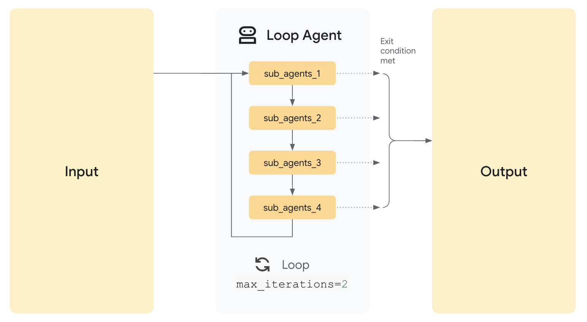

# Loop Agents in ADK

## ADK Concept: Loop Agents

In the Google Agent Development Kit (ADK), loop agents are workflow agents that repeatedly execute one or more sub-agents until a specific condition is met. This enables iterative refinement, progressive improvement, and handling of tasks that require multiple passes to complete.

### What are Loop Agents?

A loop agent orchestrates the repeated execution of sub-agents, with each iteration potentially improving or refining the output. This pattern is particularly useful for:

- Iterative refinement processes that improve quality over multiple passes
- Tasks that require progressive development of a solution
- Situations where the number of iterations needed isn't known in advance
- Processes that continue until a quality threshold or condition is met

Loop agents are one of several workflow agent types in ADK, specifically designed for processes that require repeated evaluation and refinement.

### How Loop Agents Work

The `LoopAgent` class in ADK:

1. Takes a list of sub-agents to execute in each iteration
2. When invoked, runs the sub-agents in sequence for each iteration
3. Checks after each iteration if the termination condition is met
4. Either begins a new iteration or returns the final result

Loop agents can be configured with:
- A maximum number of iterations to prevent infinite loops
- Sub-agents that run in each iteration
- Custom logic for determining when to terminate the loop



## Implementation Details

This folder contains examples of loop agent implementations in ADK.

### Project Structure
```
12-loop-agent/
├── linkedin_post_generator_agent/
│   ├── agent.py
│   ├── __init__.py
│   └── subagents/
│       ├── post_generator.py
│       ├── post_refiner.py
│       └── post_reviewer.py
└── result_imgs/
```

### Example: LinkedIn Post Generator

The LinkedIn post generator example demonstrates a loop-based workflow for iteratively improving content:

```python
from google.adk.agents import LoopAgent, SequentialAgent

from .subagents.post_generator import initial_post_generator
from .subagents.post_refiner import post_refiner
from .subagents.post_reviewer import post_reviewer

# Create the Refinement Loop Agent
refinement_loop = LoopAgent(
    name="PostRefinementLoop",
    max_iterations=10,
    sub_agents=[
        post_reviewer,
        post_refiner,
    ],
    description="Iteratively reviews and refines a LinkedIn post until quality requirements are met",
)

# Create the Sequential Pipeline
root_agent = SequentialAgent(
    name="LinkedInPostGenerationPipeline",
    sub_agents=[
        initial_post_generator,  # Step 1: Generate initial post
        refinement_loop,  # Step 2: Review and refine in a loop
    ],
    description="Generates and refines a LinkedIn post through an iterative review process",
)
```

This implementation consists of:

1. **Loop Agent (refinement_loop)**: Iteratively refines the LinkedIn post through two sub-agents:
   - **Post Reviewer**: Evaluates the current post and provides feedback
   - **Post Refiner**: Improves the post based on the reviewer's feedback

2. **Sequential Wrapper**: The root agent is a sequential agent that:
   - First generates an initial post with the initial_post_generator
   - Then passes the initial post to the refinement loop for iterative improvement

### Workflow and Execution

When the LinkedIn post generator processes a request, it follows this flow:

1. The user sends a request for a LinkedIn post on a specific topic
2. The sequential root agent passes the request to the initial post generator
3. The initial post generator creates a first draft of the LinkedIn post
4. The sequential root agent passes the draft to the refinement loop
5. Within the loop:
   - The post reviewer evaluates the current version and provides feedback
   - The post refiner improves the post based on this feedback
   - The loop agent checks if the post meets quality criteria or if max iterations is reached
   - If criteria are met or max iterations reached, the loop terminates
   - Otherwise, another iteration begins
6. The final refined post is returned to the user

### Loop Termination Conditions

Loop agents can terminate based on:

1. **Maximum Iterations**: The loop reaches the configured maximum number of iterations
2. **Quality Threshold**: The output meets predefined quality criteria
3. **Explicit Termination**: A sub-agent explicitly signals that the process is complete
4. **No Further Changes**: The output stops changing between iterations

In the LinkedIn post example, the loop could terminate when:
- The reviewer rates the post above a certain quality threshold
- The maximum of 10 iterations is reached
- The refiner indicates no further improvements are possible

### Benefits of Loop Agents

1. **Iterative Improvement**: Enables progressive refinement toward higher quality
2. **Adaptive Processing**: Applies just the right amount of processing based on need
3. **Quality Control**: Continues until quality criteria are met
4. **Flexibility**: Handles processes where the number of iterations isn't known in advance
5. **Efficiency**: Avoids under-processing or over-processing

## Best Practices for Loop Agents

1. **Clear Termination Conditions**: Define explicit criteria for when to stop looping
2. **Maximum Iteration Limit**: Always set a maximum to prevent infinite loops
3. **Progress Tracking**: Track improvements across iterations to ensure progress
4. **Sufficient Context**: Ensure sub-agents have access to previous iteration results
5. **State Management**: Use session state to maintain consistency across iterations
6. **Diminishing Returns**: Consider diminishing returns in your termination logic

## Sample Interaction

Here's an example interaction with a LinkedIn post generator loop agent:

```
User: Create a LinkedIn post about our new AI-powered customer service platform that just launched.

Agent: 

# LinkedIn Post - AI Customer Service Platform Launch

We're thrilled to announce the launch of ServiceAI, our new AI-powered customer service platform! 🚀

ServiceAI combines advanced natural language processing with automation to deliver exceptional customer experiences. Key features include:

• 24/7 intelligent support across all channels
• 90% faster resolution times
• Seamless escalation to human agents when needed
• Personalized interactions based on customer history

Early adopters are already seeing a 35% reduction in support costs while improving customer satisfaction scores by 28%.

Want to see how ServiceAI can transform your customer service operations? DM me for a personalized demo or visit servicea.ai/demo to learn more.

#CustomerService #AI #Innovation #CX #DigitalTransformation

[This post was refined over 4 iterations by our AI system to optimize for engagement, clarity, and impact]
```

## Loop Agent Design Patterns

### 1. Review and Refine Pattern

Used in the LinkedIn post example, this pattern consists of:
- A reviewer agent that evaluates the current state
- A refiner agent that makes improvements based on the review

This pattern is useful for content creation, document editing, and any task requiring quality improvement.

### 2. Progressive Development Pattern

This pattern builds a complex output through incremental additions:
- Each iteration adds a new component or layer
- The loop continues until the output is complete

This pattern is useful for creating structured documents, multi-part analyses, or detailed plans.

### 3. Converge to Solution Pattern

This pattern repeatedly applies transformations until reaching a stable state:
- Each iteration applies transformations to the current state
- The loop continues until changes become minimal or a solution is found

This pattern is useful for optimization problems, simulations, and incremental approximations.

## Comparison with Other Workflow Agents

Loop agents are one of several workflow agent types in ADK:

- **Loop Agent**: Executes the same sub-agent(s) repeatedly until a condition is met
- **Sequential Agent**: Executes sub-agents in a predefined order (A → B → C)
- **Parallel Agent**: Executes sub-agents simultaneously (A+B+C)

Choose the appropriate workflow agent based on your specific requirements:

- Use **Loop Agent** when tasks need to be repeated until a condition is satisfied
- Use **Sequential Agent** when steps must follow a specific order
- Use **Parallel Agent** when steps can be executed independently

## Advanced Patterns

### Hybrid Workflows

Loop agents can be combined with other workflow agents:

```python
# Sequential + Loop + Parallel
complex_workflow = SequentialAgent(
    sub_agents=[
        initial_processor,
        LoopAgent(
            sub_agents=[
                refiner,
                ParallelAgent(sub_agents=[evaluator1, evaluator2, evaluator3]),
            ],
            max_iterations=5,
        ),
        final_processor,
    ],
)
```

### Nested Loops

Loop agents can be nested for multi-level iterative processes:

```python
# Outer loop handles chapters, inner loop handles paragraphs
document_generator = LoopAgent(
    name="ChapterGenerator",
    sub_agents=[
        chapter_planner,
        LoopAgent(
            name="ParagraphGenerator",
            sub_agents=[paragraph_generator, paragraph_reviewer],
            max_iterations=3,
        ),
        chapter_reviewer,
    ],
    max_iterations=10,
)
```

## Next Steps

After understanding loop agents and exploring all the workflow agent types, you might want to:
- Experiment with combining different workflow agents for complex applications
- Implement custom termination logic for loop agents
- Explore advanced state management across workflow agent iterations

For more information, visit the ADK Workflow Agents documentation. (https://google.github.io/adk-docs/agents/workflow-agents/)
